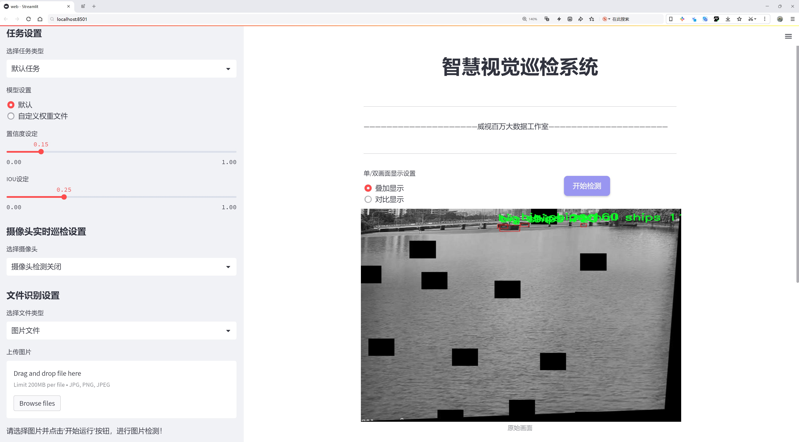
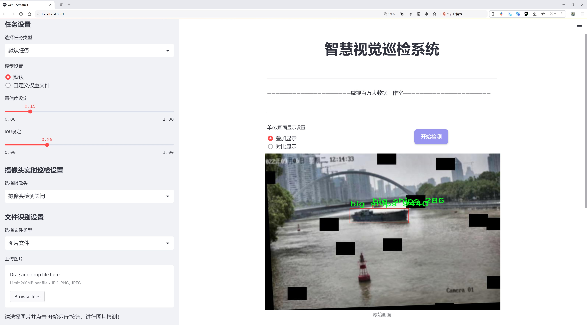
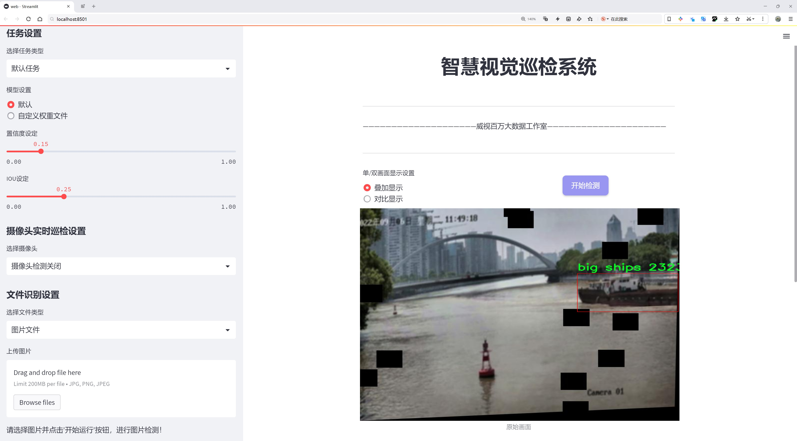
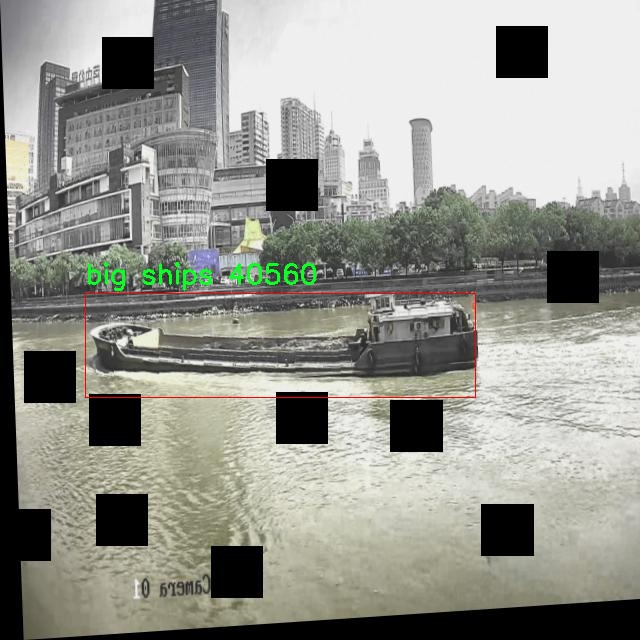
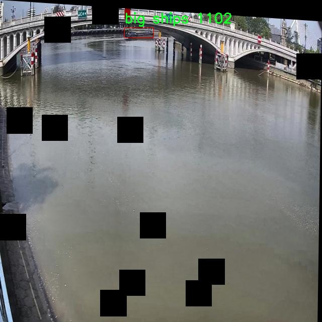
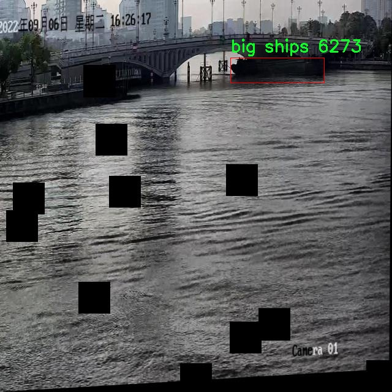
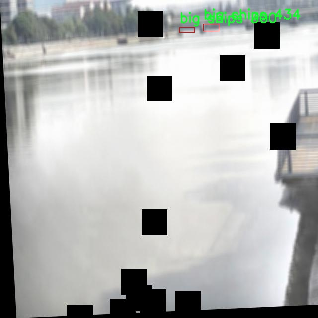
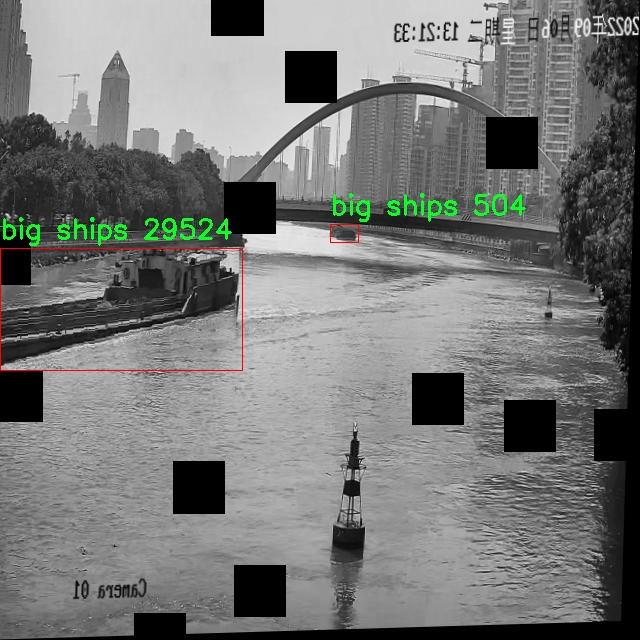

# 船只类型识别检测系统源码分享
 # [一条龙教学YOLOV8标注好的数据集一键训练_70+全套改进创新点发刊_Web前端展示]

### 1.研究背景与意义

项目参考[AAAI Association for the Advancement of Artificial Intelligence](https://gitee.com/qunmasj/projects)

项目来源[AACV Association for the Advancement of Computer Vision](https://kdocs.cn/l/cszuIiCKVNis)

研究背景与意义

随着全球贸易的不断发展，海洋运输在国际经济中扮演着越来越重要的角色。船只作为海洋运输的主要载体，其类型的识别与分类对于航运管理、海洋安全、环境保护等领域具有重要的现实意义。传统的船只识别方法多依赖于人工观察和经验判断，效率低下且容易受到人为因素的影响，难以满足现代海洋运输管理的需求。因此，开发一种高效、准确的船只类型识别系统显得尤为重要。

近年来，深度学习技术的迅猛发展为计算机视觉领域带来了革命性的变化，尤其是在目标检测任务中，YOLO（You Only Look Once）系列模型因其高效性和准确性而广泛应用于各种场景。YOLOv8作为该系列的最新版本，具备了更强的特征提取能力和更快的推理速度，能够在复杂的环境中实现实时目标检测。基于YOLOv8的船只类型识别系统，能够有效提升船只识别的准确性和实时性，为海洋运输管理提供强有力的技术支持。

本研究所使用的数据集“Ship Recognition Augmented”包含3500张图像，涵盖了大船和小船两类，具有较高的代表性和多样性。这一数据集的构建为模型的训练和评估提供了坚实的基础。通过对不同类型船只的图像进行标注和分类，研究者能够利用YOLOv8模型进行有效的特征学习和分类，从而实现对船只类型的自动识别。这不仅能够提高识别的准确性，还能大幅度降低人工成本，提高工作效率。

此外，船只类型识别系统的应用场景广泛。首先，在海洋监测与管理中，系统能够实时监测船只的动态，为海洋环境保护和资源管理提供数据支持。其次，在海关和港口管理中，准确的船只识别能够提高通关效率，减少非法活动的发生。此外，在海洋安全领域，系统能够及时识别潜在的安全威胁，保障海洋运输的安全与稳定。

综上所述，基于改进YOLOv8的船只类型识别系统的研究，不仅具有重要的理论价值，也具备广泛的应用前景。通过对船只类型的准确识别，能够为海洋运输管理提供科学依据，推动相关领域的技术进步与发展。未来，随着数据集的不断扩展和模型的进一步优化，该系统有望在更复杂的海洋环境中发挥更大的作用，为全球海洋经济的可持续发展贡献力量。

### 2.图片演示







##### 注意：由于此博客编辑较早，上面“2.图片演示”和“3.视频演示”展示的系统图片或者视频可能为老版本，新版本在老版本的基础上升级如下：（实际效果以升级的新版本为准）

  （1）适配了YOLOV8的“目标检测”模型和“实例分割”模型，通过加载相应的权重（.pt）文件即可自适应加载模型。

  （2）支持“图片识别”、“视频识别”、“摄像头实时识别”三种识别模式。

  （3）支持“图片识别”、“视频识别”、“摄像头实时识别”三种识别结果保存导出，解决手动导出（容易卡顿出现爆内存）存在的问题，识别完自动保存结果并导出到tempDir中。

  （4）支持Web前端系统中的标题、背景图等自定义修改，后面提供修改教程。

  另外本项目提供训练的数据集和训练教程,暂不提供权重文件（best.pt）,需要您按照教程进行训练后实现图片演示和Web前端界面演示的效果。

### 3.视频演示

[3.1 视频演示](https://www.bilibili.com/video/BV1yZsaeDECy/)

### 4.数据集信息展示

##### 4.1 本项目数据集详细数据（类别数＆类别名）

nc: 2
names: ['big ships', 'small ships']


##### 4.2 本项目数据集信息介绍

数据集信息展示

在现代海洋监测与管理中，船只类型的准确识别是确保航运安全、环境保护和资源管理的重要环节。为此，开发出高效且准确的船只识别系统显得尤为重要。本研究采用的数据集名为“Ship Recognition Augmented”，旨在为改进YOLOv8模型提供丰富的训练数据，以提升其在船只类型识别方面的性能。该数据集专注于两种主要的船只类型，分别为“大型船只”和“小型船只”，共计两个类别。

数据集的构建过程经过精心设计，确保了样本的多样性和代表性。首先，数据集涵盖了不同环境下的船只图像，包括港口、开放海域以及内河等多种场景。这种多样化的环境设置使得模型在训练过程中能够学习到不同光照、天气条件以及背景复杂度对船只识别的影响。此外，数据集中还包含了不同角度、不同距离拍摄的船只图像，以增强模型的鲁棒性。

在数据标注方面，所有图像均经过专业人员的精确标注，确保每一张图像中的船只类型都被准确识别和分类。标注信息不仅包括船只的类别，还涵盖了其在图像中的位置和尺寸。这种详细的标注方式为模型提供了必要的监督信号，使其能够在训练过程中有效地学习到船只的特征。

为了进一步增强数据集的实用性，研究团队还采用了数据增强技术，对原始图像进行了多种变换，如旋转、缩放、翻转和颜色调整等。这些增强操作不仅增加了数据集的样本数量，还提高了模型对不同视觉变换的适应能力，进而提升了其在实际应用中的表现。

“Ship Recognition Augmented”数据集的设计目标是为改进YOLOv8模型提供一个高质量的训练基础。YOLOv8作为一种先进的目标检测算法，其在实时性和准确性方面均表现出色。通过利用该数据集，研究人员希望能够优化YOLOv8在船只类型识别任务中的性能，使其能够在复杂的海洋环境中快速而准确地识别出不同类型的船只。

在未来的研究中，数据集的持续扩展和更新将是一个重要方向。随着技术的进步和应用需求的变化，研究团队计划不断收集新的船只图像，特别是那些在特定条件下难以识别的船只类型。这不仅有助于提高模型的准确性，也将为船只识别技术的进一步发展提供新的动力。

总之，“Ship Recognition Augmented”数据集为改进YOLOv8的船只类型识别系统提供了坚实的基础，通过多样化的样本、精确的标注和有效的数据增强，旨在推动船只识别技术的进步，为海洋安全和管理贡献力量。











### 5.全套项目环境部署视频教程（零基础手把手教学）

[5.1 环境部署教程链接（零基础手把手教学）](https://www.ixigua.com/7404473917358506534?logTag=c807d0cbc21c0ef59de5)


[5.2 安装Python虚拟环境创建和依赖库安装视频教程链接（零基础手把手教学）](https://www.ixigua.com/7404474678003106304?logTag=1f1041108cd1f708b01a)

### 6.手把手YOLOV8训练视频教程（零基础小白有手就能学会）

[6.1 手把手YOLOV8训练视频教程（零基础小白有手就能学会）](https://www.ixigua.com/7404477157818401292?logTag=d31a2dfd1983c9668658)

### 7.70+种全套YOLOV8创新点代码加载调参视频教程（一键加载写好的改进模型的配置文件）

[7.1 70+种全套YOLOV8创新点代码加载调参视频教程（一键加载写好的改进模型的配置文件）](https://www.ixigua.com/7404478314661806627?logTag=29066f8288e3f4eea3a4)

### 8.70+种全套YOLOV8创新点原理讲解（非科班也可以轻松写刊发刊，V10版本正在科研待更新）

由于篇幅限制，每个创新点的具体原理讲解就不一一展开，具体见下列网址中的创新点对应子项目的技术原理博客网址【Blog】：


[8.1 70+种全套YOLOV8创新点原理讲解链接](https://gitee.com/qunmasj/good)

### 9.系统功能展示（检测对象为举例，实际内容以本项目数据集为准）

图9.1.系统支持检测结果表格显示

  图9.2.系统支持置信度和IOU阈值手动调节

  图9.3.系统支持自定义加载权重文件best.pt(需要你通过步骤5中训练获得)

  图9.4.系统支持摄像头实时识别

  图9.5.系统支持图片识别

  图9.6.系统支持视频识别

  图9.7.系统支持识别结果文件自动保存

  图9.8.系统支持Excel导出检测结果数据


### 10.原始YOLOV8算法原理

原始YOLOv8算法原理

YOLOv8算法是目标检测领域的一项重要进展，承载着YOLO系列模型的演变与创新。作为YOLO系列的最新版本，YOLOv8在保留了前代模型优点的基础上，融入了多项新的设计理念与技术，旨在提升目标检测的精度与速度。YOLOv8的核心架构由输入层、Backbone（骨干网络）、Neck（特征融合网络）和Head（检测模块）四个主要部分构成，形成了一个高效且灵活的目标检测系统。

在数据预处理方面，YOLOv8延续了YOLOv5的策略，采用了多种增强手段，包括马赛克增强、混合增强、空间扰动和颜色扰动等。这些技术不仅提高了模型的鲁棒性，还使得模型在不同场景下的表现更加稳定。通过对输入图像进行预处理，YOLOv8能够更好地适应多样化的目标特征，从而提升后续特征提取的效果。

YOLOv8的Backbone部分采用了CSPDarknet结构，旨在通过分层的特征提取来增强模型的表达能力。与YOLOv5不同的是，YOLOv8引入了C2f模块替代了C3模块。C2f模块通过将输入特征图分为两个分支并进行独立处理，能够有效地增强梯度流动，促进信息的有效传递。每个分支经过卷积层降维后，最终通过融合操作生成更高维度的特征图。这种设计不仅提升了特征提取的效率，还为后续的目标检测提供了更为丰富的特征信息。

在特征融合方面，YOLOv8采用了FPN-PAN结构，这一结构通过特征金字塔网络与路径聚合网络的结合，充分整合了多尺度特征信息。FPN负责将不同层次的特征进行融合，以便捕捉到目标的语义信息，而PAN则进一步增强了特征的定位能力。这种双塔结构的设计，使得YOLOv8在处理不同尺度的目标时，能够更加精准地提取相关特征，从而提升检测性能。

YOLOv8的Head部分采用了解耦头结构，标志着目标检测方法的一次重要转变。传统的耦合头在处理分类与定位任务时往往会造成信息的混淆，而解耦头则将这两个任务分开处理。通过分别提取类别特征和位置特征，YOLOv8能够更有效地进行目标检测。具体而言，解耦头结构中包含两条并行的分支，分别负责分类和定位的任务，这种设计不仅加速了模型的收敛速度，还提升了检测的准确性。

在标签分配策略上，YOLOv8采用了TOOD策略，这是一种动态标签分配的方法。与YOLOv5依赖于聚类候选框的方式不同，YOLOv8通过直接对目标进行分类与定位，简化了标签分配的过程。这种策略不仅提高了模型对不同目标的适应能力，还减少了因数据集不充分而导致的标签不准确问题。YOLOv8的损失函数由类别损失和位置损失两部分组成，其中类别损失采用了Varifocal Loss（VFL），而位置损失则结合了CIoU Loss与DFL Loss。这种设计使得模型在训练过程中能够更好地关注高质量的正样本，同时降低负样本对损失的影响，从而有效提升了模型的整体性能。

总的来说，YOLOv8算法通过一系列创新的设计与改进，提升了目标检测的效率与准确性。其高效的特征提取、灵活的特征融合、解耦的检测头以及动态的标签分配策略，使得YOLOv8在面对复杂的目标检测任务时，能够表现出色。作为YOLO系列的最新版本，YOLOv8不仅延续了前代模型的优良传统，更为未来的目标检测研究提供了新的思路与方向。随着YOLOv8的不断发展与应用，其在智能监控、自动驾驶、无人机视觉等领域的潜力将会得到进一步的挖掘与实现。


### 11.项目核心源码讲解（再也不用担心看不懂代码逻辑）

#### 11.1 code\ultralytics\models\sam\modules\sam.py

下面是对代码的核心部分进行提炼和详细注释的结果：

```python
# 导入必要的库
from typing import List
import torch
from torch import nn

# 引入解码器和编码器
from .decoders import MaskDecoder
from .encoders import ImageEncoderViT, PromptEncoder

class Sam(nn.Module):
    """
    Sam (Segment Anything Model) 是一个用于对象分割任务的模型。它使用图像编码器生成图像嵌入，并使用提示编码器对各种类型的输入提示进行编码。这些嵌入随后被掩码解码器用于预测对象掩码。

    属性:
        mask_threshold (float): 掩码预测的阈值。
        image_format (str): 输入图像的格式，默认为 'RGB'。
        image_encoder (ImageEncoderViT): 用于将图像编码为嵌入的主干网络。
        prompt_encoder (PromptEncoder): 编码各种类型的输入提示。
        mask_decoder (MaskDecoder): 从图像和提示嵌入中预测对象掩码。
        pixel_mean (List[float]): 用于图像归一化的均值像素值。
        pixel_std (List[float]): 用于图像归一化的标准差值。
    """

    # 掩码预测的阈值，默认为0.0
    mask_threshold: float = 0.0
    # 输入图像的格式，默认为'RGB'
    image_format: str = "RGB"

    def __init__(
        self,
        image_encoder: ImageEncoderViT,  # 图像编码器
        prompt_encoder: PromptEncoder,    # 提示编码器
        mask_decoder: MaskDecoder,        # 掩码解码器
        pixel_mean: List[float] = (123.675, 116.28, 103.53),  # 像素均值
        pixel_std: List[float] = (58.395, 57.12, 57.375),      # 像素标准差
    ) -> None:
        """
        初始化 Sam 类以从图像和输入提示中预测对象掩码。

        注意:
            所有的 forward() 操作已移至 SAMPredictor。

        参数:
            image_encoder (ImageEncoderViT): 用于将图像编码为图像嵌入的主干网络。
            prompt_encoder (PromptEncoder): 编码各种类型的输入提示。
            mask_decoder (MaskDecoder): 从图像嵌入和编码的提示中预测掩码。
            pixel_mean (List[float], optional): 用于归一化输入图像像素的均值，默认为 (123.675, 116.28, 103.53)。
            pixel_std (List[float], optional): 用于归一化输入图像像素的标准差，默认为 (58.395, 57.12, 57.375)。
        """
        super().__init__()  # 调用父类的初始化方法
        self.image_encoder = image_encoder  # 初始化图像编码器
        self.prompt_encoder = prompt_encoder  # 初始化提示编码器
        self.mask_decoder = mask_decoder  # 初始化掩码解码器
        # 注册像素均值和标准差，用于图像归一化
        self.register_buffer("pixel_mean", torch.Tensor(pixel_mean).view(-1, 1, 1), False)
        self.register_buffer("pixel_std", torch.Tensor(pixel_std).view(-1, 1, 1), False)
```

### 代码核心部分分析：
1. **类定义**：`Sam` 类是一个继承自 `nn.Module` 的模型，专注于对象分割任务。
2. **属性**：
   - `mask_threshold` 和 `image_format` 用于设置掩码预测的阈值和图像格式。
   - `image_encoder`、`prompt_encoder` 和 `mask_decoder` 分别用于图像编码、提示编码和掩码预测。
   - `pixel_mean` 和 `pixel_std` 用于图像预处理，确保输入图像在模型训练时的均值和标准差一致。
3. **初始化方法**：构造函数中初始化了模型的各个组件，并注册了用于图像归一化的均值和标准差。

该文件定义了一个名为 `Sam` 的类，属于 Ultralytics YOLO 项目的一部分，主要用于对象分割任务。该类继承自 PyTorch 的 `nn.Module`，并包含了多个组件，用于处理图像和输入提示，最终生成对象的掩码。

在类的文档字符串中，详细描述了 `Sam` 的功能和主要属性。`Sam` 通过图像编码器生成图像嵌入，并通过提示编码器对不同类型的输入提示进行编码。这些嵌入随后被掩码解码器使用，以预测对象的掩码。

该类的主要属性包括：
- `mask_threshold`：用于掩码预测的阈值，初始值为 0.0。
- `image_format`：输入图像的格式，默认为 'RGB'。
- `image_encoder`：用于将图像编码为嵌入的主干网络，类型为 `ImageEncoderViT`。
- `prompt_encoder`：用于编码各种类型输入提示的编码器，类型为 `PromptEncoder`。
- `mask_decoder`：从图像和提示嵌入中预测对象掩码的解码器，类型为 `MaskDecoder`。
- `pixel_mean` 和 `pixel_std`：用于图像归一化的均值和标准差，分别为三个通道的值。

在 `__init__` 方法中，`Sam` 类的实例被初始化。构造函数接受三个主要参数：`image_encoder`、`prompt_encoder` 和 `mask_decoder`，它们分别用于图像嵌入的生成、提示的编码和掩码的预测。此外，还可以选择性地传入用于图像归一化的均值和标准差。

在初始化过程中，调用了父类的构造函数，并将传入的编码器和解码器赋值给相应的属性。同时，使用 `register_buffer` 方法注册了均值和标准差，以便在模型训练和推理时使用，而不需要将它们视为模型的可学习参数。

总的来说，`Sam` 类是一个高度模块化的对象分割模型，整合了图像处理和提示处理的功能，旨在通过深度学习技术实现高效的对象分割。

#### 11.2 code\ultralytics\data\base.py

以下是代码中最核心的部分，并附上详细的中文注释：

```python
class BaseDataset(Dataset):
    """
    基础数据集类，用于加载和处理图像数据。

    参数:
        img_path (str): 图像文件夹的路径。
        imgsz (int, optional): 图像大小，默认为640。
        cache (bool, optional): 在训练期间将图像缓存到RAM或磁盘，默认为False。
        augment (bool, optional): 如果为True，则应用数据增强，默认为True。
        hyp (dict, optional): 应用数据增强的超参数，默认为None。
        prefix (str, optional): 日志消息中打印的前缀，默认为''。
        rect (bool, optional): 如果为True，则使用矩形训练，默认为False。
        batch_size (int, optional): 批次大小，默认为None。
        stride (int, optional): 步幅，默认为32。
        pad (float, optional): 填充，默认为0.0。
        single_cls (bool, optional): 如果为True，则使用单类训练，默认为False。
        classes (list): 包含的类的列表，默认为None。
        fraction (float): 使用的数据集的比例，默认为1.0（使用所有数据）。

    属性:
        im_files (list): 图像文件路径列表。
        labels (list): 标签数据字典列表。
        ni (int): 数据集中图像的数量。
        ims (list): 加载的图像列表。
        npy_files (list): numpy文件路径列表。
        transforms (callable): 图像转换函数。
    """

    def __init__(self, img_path, imgsz=640, cache=False, augment=True, hyp=DEFAULT_CFG, prefix="", rect=False, batch_size=16, stride=32, pad=0.5, single_cls=False, classes=None, fraction=1.0):
        """使用给定的配置和选项初始化BaseDataset。"""
        super().__init__()
        self.img_path = img_path  # 图像路径
        self.imgsz = imgsz  # 图像大小
        self.augment = augment  # 是否应用数据增强
        self.single_cls = single_cls  # 是否使用单类训练
        self.prefix = prefix  # 日志前缀
        self.fraction = fraction  # 使用的数据集比例
        self.im_files = self.get_img_files(self.img_path)  # 获取图像文件列表
        self.labels = self.get_labels()  # 获取标签
        self.update_labels(include_class=classes)  # 更新标签以包含指定的类
        self.ni = len(self.labels)  # 数据集中图像的数量
        self.rect = rect  # 是否使用矩形训练
        self.batch_size = batch_size  # 批次大小
        self.stride = stride  # 步幅
        self.pad = pad  # 填充
        if self.rect:
            assert self.batch_size is not None  # 确保批次大小已定义
            self.set_rectangle()  # 设置矩形训练

        # 用于缓存图像的缓冲区
        self.buffer = []  # 缓冲区大小 = 批次大小
        self.max_buffer_length = min((self.ni, self.batch_size * 8, 1000)) if self.augment else 0  # 最大缓冲区长度

        # 缓存图像
        if cache == "ram" and not self.check_cache_ram():
            cache = False  # 如果RAM缓存不可用，则不缓存
        self.ims, self.im_hw0, self.im_hw = [None] * self.ni, [None] * self.ni, [None] * self.ni  # 初始化图像列表
        self.npy_files = [Path(f).with_suffix(".npy") for f in self.im_files]  # numpy文件路径
        if cache:
            self.cache_images(cache)  # 缓存图像

        # 图像转换
        self.transforms = self.build_transforms(hyp=hyp)  # 构建图像转换

    def get_img_files(self, img_path):
        """读取图像文件。"""
        try:
            f = []  # 图像文件列表
            for p in img_path if isinstance(img_path, list) else [img_path]:
                p = Path(p)  # 处理路径
                if p.is_dir():  # 如果是目录
                    f += glob.glob(str(p / "**" / "*.*"), recursive=True)  # 递归获取所有图像文件
                elif p.is_file():  # 如果是文件
                    with open(p) as t:
                        t = t.read().strip().splitlines()  # 读取文件内容
                        parent = str(p.parent) + os.sep
                        f += [x.replace("./", parent) if x.startswith("./") else x for x in t]  # 转换为全局路径
                else:
                    raise FileNotFoundError(f"{self.prefix}{p} does not exist")  # 文件不存在
            im_files = sorted(x.replace("/", os.sep) for x in f if x.split(".")[-1].lower() in IMG_FORMATS)  # 过滤并排序图像文件
            assert im_files, f"{self.prefix}No images found in {img_path}"  # 确保找到图像
        except Exception as e:
            raise FileNotFoundError(f"{self.prefix}Error loading data from {img_path}\n{HELP_URL}") from e  # 错误处理
        if self.fraction < 1:
            im_files = im_files[: round(len(im_files) * self.fraction)]  # 根据比例截取图像文件
        return im_files

    def load_image(self, i, rect_mode=True):
        """从数据集中加载一张图像，返回图像及其调整后的尺寸。"""
        im, f, fn = self.ims[i], self.im_files[i], self.npy_files[i]  # 获取图像、文件路径和numpy文件路径
        if im is None:  # 如果图像未缓存
            if fn.exists():  # 如果numpy文件存在
                try:
                    im = np.load(fn)  # 加载numpy文件
                except Exception as e:
                    LOGGER.warning(f"{self.prefix}WARNING ⚠️ Removing corrupt *.npy image file {fn} due to: {e}")  # 警告并删除损坏的文件
                    Path(fn).unlink(missing_ok=True)  # 删除损坏的文件
                    im = cv2.imread(f)  # 读取图像
            else:  # 读取图像
                im = cv2.imread(f)  # 读取图像
            if im is None:
                raise FileNotFoundError(f"Image Not Found {f}")  # 图像未找到

            h0, w0 = im.shape[:2]  # 获取原始图像尺寸
            if rect_mode:  # 如果使用矩形模式
                r = self.imgsz / max(h0, w0)  # 计算缩放比例
                if r != 1:  # 如果尺寸不相等
                    w, h = (min(math.ceil(w0 * r), self.imgsz), min(math.ceil(h0 * r), self.imgsz))  # 计算调整后的尺寸
                    im = cv2.resize(im, (w, h), interpolation=cv2.INTER_LINEAR)  # 调整图像尺寸
            elif not (h0 == w0 == self.imgsz):  # 如果不是正方形
                im = cv2.resize(im, (self.imgsz, self.imgsz), interpolation=cv2.INTER_LINEAR)  # 将图像拉伸为正方形

            # 如果进行数据增强，则将图像添加到缓冲区
            if self.augment:
                self.ims[i], self.im_hw0[i], self.im_hw[i] = im, (h0, w0), im.shape[:2]  # 缓存图像及其尺寸
                self.buffer.append(i)  # 将索引添加到缓冲区
                if len(self.buffer) >= self.max_buffer_length:  # 如果缓冲区已满
                    j = self.buffer.pop(0)  # 移除最旧的索引
                    self.ims[j], self.im_hw0[j], self.im_hw[j] = None, None, None  # 清空缓存

            return im, (h0, w0), im.shape[:2]  # 返回图像及其尺寸

        return self.ims[i], self.im_hw0[i], self.im_hw[i]  # 返回缓存的图像及其尺寸

    def __getitem__(self, index):
        """返回给定索引的转换标签信息。"""
        return self.transforms(self.get_image_and_label(index))  # 获取图像和标签并应用转换

    def __len__(self):
        """返回数据集中标签列表的长度。"""
        return len(self.labels)  # 返回标签数量

    def build_transforms(self, hyp=None):
        """
        用户可以在此自定义增强。

        示例:
            ```python
            if self.augment:
                # 训练转换
                return Compose([])
            else:
                # 验证转换
                return Compose([])
            ```
        """
        raise NotImplementedError  # 抛出未实现错误

    def get_labels(self):
        """
        用户可以在此自定义标签格式。

        注意:
            确保输出是一个包含以下键的字典:
            ```python
            dict(
                im_file=im_file,
                shape=shape,  # 格式: (高度, 宽度)
                cls=cls,
                bboxes=bboxes, # xywh
                segments=segments,  # xy
                keypoints=keypoints, # xy
                normalized=True, # 或 False
                bbox_format="xyxy",  # 或 xywh, ltwh
            )
            ```
        """
        raise NotImplementedError  # 抛出未实现错误
```

### 代码说明：
1. **BaseDataset类**：继承自`Dataset`，用于加载和处理图像数据。
2. **初始化方法**：设置图像路径、大小、增强方式等参数，并调用相关方法初始化图像和标签。
3. **获取图像文件**：通过路径读取图像文件，支持目录和文件列表。
4. **加载图像**：根据索引加载图像，支持缓存机制和图像调整。
5. **获取标签**：提供获取标签的接口，用户可以自定义标签格式。
6. **数据增强**：提供数据增强的接口，用户可以自定义增强方式。

这个类是YOLO模型训练中数据集处理的基础，提供了图像加载、标签处理和数据增强的功能。

这个程序文件定义了一个名为 `BaseDataset` 的类，主要用于加载和处理图像数据，特别是在训练计算机视觉模型时。该类继承自 PyTorch 的 `Dataset` 类，提供了一系列方法和属性，以便于管理图像数据集。

在初始化方法 `__init__` 中，类接受多个参数，包括图像路径、图像大小、是否缓存图像、数据增强选项、超参数、批处理大小等。根据这些参数，类会读取图像文件并初始化相关属性，例如图像文件路径列表、标签数据、图像数量等。

`get_img_files` 方法用于读取指定路径下的图像文件。它支持读取目录中的所有图像文件，也可以从文件中读取图像路径。该方法会根据指定的图像格式过滤文件，并返回有效的图像文件路径列表。如果指定了数据集的使用比例，方法会根据该比例返回相应数量的图像文件。

`update_labels` 方法用于更新标签信息，确保只包含指定的类别。如果设置了单类训练，所有标签的类别都会被设置为同一类。

`load_image` 方法用于加载指定索引的图像。如果图像未缓存，它会从文件中读取图像，并根据需要调整图像大小。该方法还会在进行数据增强时将图像添加到缓冲区，以便后续使用。

`cache_images` 和 `cache_images_to_disk` 方法用于将图像缓存到内存或磁盘，以加快后续的加载速度。`check_cache_ram` 方法用于检查系统内存是否足够缓存图像，确保不会因为内存不足而导致程序崩溃。

`set_rectangle` 方法用于设置 YOLO 检测的边界框形状为矩形，以适应不同的图像长宽比。

`__getitem__` 方法用于根据索引返回经过变换的标签信息，`get_image_and_label` 方法则获取图像及其对应的标签信息。

`__len__` 方法返回数据集中标签的数量，`update_labels_info` 方法可以自定义标签格式。

`build_transforms` 和 `get_labels` 方法是抽象方法，用户可以根据自己的需求实现具体的图像增强和标签格式化逻辑。

总体而言，这个类提供了一个灵活的框架，用于处理图像数据集，支持多种配置选项和数据增强策略，非常适合用于训练深度学习模型。

#### 11.3 code\ultralytics\trackers\bot_sort.py

以下是经过简化和注释的核心代码部分，保留了最重要的功能和结构：

```python
# 导入必要的库
from collections import deque
import numpy as np
from .basetrack import TrackState
from .byte_tracker import BYTETracker, STrack
from .utils import matching
from .utils.gmc import GMC
from .utils.kalman_filter import KalmanFilterXYWH

class BOTrack(STrack):
    """
    BOTrack类扩展了STrack类，添加了对象跟踪功能。
    """

    # 共享的卡尔曼滤波器实例
    shared_kalman = KalmanFilterXYWH()

    def __init__(self, tlwh, score, cls, feat=None, feat_history=50):
        """初始化BOTrack实例，设置初始参数。"""
        super().__init__(tlwh, score, cls)  # 调用父类构造函数

        self.smooth_feat = None  # 平滑特征向量
        self.curr_feat = None  # 当前特征向量
        if feat is not None:
            self.update_features(feat)  # 更新特征
        self.features = deque([], maxlen=feat_history)  # 存储特征的双端队列
        self.alpha = 0.9  # 平滑因子

    def update_features(self, feat):
        """更新特征向量并使用指数移动平均进行平滑处理。"""
        feat /= np.linalg.norm(feat)  # 归一化特征
        self.curr_feat = feat  # 设置当前特征
        if self.smooth_feat is None:
            self.smooth_feat = feat  # 初始化平滑特征
        else:
            # 使用指数移动平均更新平滑特征
            self.smooth_feat = self.alpha * self.smooth_feat + (1 - self.alpha) * feat
        self.features.append(feat)  # 将特征添加到队列
        self.smooth_feat /= np.linalg.norm(self.smooth_feat)  # 归一化平滑特征

    def predict(self):
        """使用卡尔曼滤波器预测状态的均值和协方差。"""
        mean_state = self.mean.copy()  # 复制当前均值状态
        if self.state != TrackState.Tracked:
            mean_state[6] = 0  # 如果未被跟踪，设置速度为0
            mean_state[7] = 0

        # 进行预测
        self.mean, self.covariance = self.kalman_filter.predict(mean_state, self.covariance)

    @property
    def tlwh(self):
        """获取当前边界框位置，格式为(top left x, top left y, width, height)。"""
        if self.mean is None:
            return self._tlwh.copy()  # 如果均值为None，返回原始边界框
        ret = self.mean[:4].copy()  # 复制均值的前四个元素
        ret[:2] -= ret[2:] / 2  # 计算左上角坐标
        return ret

class BOTSORT(BYTETracker):
    """
    BOTSORT类扩展了BYTETracker类，设计用于YOLOv8的对象跟踪。
    """

    def __init__(self, args, frame_rate=30):
        """初始化BOTSORT实例，设置跟踪参数。"""
        super().__init__(args, frame_rate)  # 调用父类构造函数
        self.proximity_thresh = args.proximity_thresh  # 空间接近阈值
        self.appearance_thresh = args.appearance_thresh  # 外观相似性阈值
        self.gmc = GMC(method=args.gmc_method)  # GMC算法实例

    def init_track(self, dets, scores, cls, img=None):
        """根据检测结果初始化跟踪。"""
        if len(dets) == 0:
            return []
        # 根据是否启用ReID来初始化跟踪
        return [BOTrack(xyxy, s, c) for (xyxy, s, c) in zip(dets, scores, cls)]

    def get_dists(self, tracks, detections):
        """计算跟踪和检测之间的距离。"""
        dists = matching.iou_distance(tracks, detections)  # 计算IoU距离
        dists_mask = dists > self.proximity_thresh  # 根据阈值生成掩码

        # 如果启用ReID，计算外观距离
        return dists  # 返回计算的距离

    def multi_predict(self, tracks):
        """预测和跟踪多个对象。"""
        BOTrack.multi_predict(tracks)  # 调用BOTrack的多预测方法
```

### 代码说明：
1. **BOTrack类**：扩展了STrack类，添加了对象跟踪的功能。主要使用卡尔曼滤波器来预测物体的状态，并通过特征向量来进行跟踪。
2. **特征更新**：通过`update_features`方法来更新当前特征，并使用指数移动平均来平滑特征。
3. **预测功能**：`predict`方法使用卡尔曼滤波器预测物体的状态。
4. **BOTSORT类**：扩展了BYTETracker类，主要用于YOLOv8的对象跟踪，包含初始化跟踪和计算距离的方法。

以上代码和注释旨在提供对YOLOv8对象跟踪实现的核心理解。

该程序文件 `bot_sort.py` 是 Ultralytics YOLO 的一部分，主要实现了基于 BoT-SORT 算法的目标跟踪功能。该文件定义了两个主要类：`BOTrack` 和 `BOTSORT`，分别用于表示单个目标的跟踪状态和整体的跟踪管理。

`BOTrack` 类是对 `STrack` 类的扩展，增加了对象跟踪的特性。它包含了一些重要的属性和方法。属性方面，`shared_kalman` 是一个共享的卡尔曼滤波器实例，用于所有 `BOTrack` 实例的状态预测；`smooth_feat` 和 `curr_feat` 分别表示平滑后的特征向量和当前特征向量；`features` 是一个双端队列，用于存储特征向量，最大长度由 `feat_history` 决定；`alpha` 是用于特征平滑的因子；`mean` 和 `covariance` 分别表示卡尔曼滤波器的均值状态和协方差矩阵。

在方法方面，`update_features` 用于更新特征向量并使用指数移动平均进行平滑；`predict` 方法利用卡尔曼滤波器预测目标的状态；`re_activate` 和 `update` 方法用于更新跟踪状态；`tlwh` 属性返回当前目标的位置；`multi_predict` 方法用于同时预测多个目标的状态；`convert_coords` 和 `tlwh_to_xywh` 方法用于坐标格式的转换。

`BOTSORT` 类是对 `BYTETracker` 类的扩展，专门为 YOLOv8 设计，支持基于 ReID 和 GMC 算法的目标跟踪。它的属性包括空间接近度阈值和外观相似度阈值，`encoder` 用于处理 ReID 嵌入，`gmc` 是数据关联的 GMC 算法实例。

在方法方面，`get_kalmanfilter` 返回一个卡尔曼滤波器实例；`init_track` 方法用于初始化跟踪，接收检测结果、分数和类别；`get_dists` 方法计算跟踪与检测之间的距离，支持 IoU 和 ReID 嵌入的结合；`multi_predict` 方法用于预测和跟踪多个对象；`reset` 方法用于重置跟踪器。

整体来看，该文件实现了一个功能强大的目标跟踪系统，结合了卡尔曼滤波、特征平滑和数据关联算法，适用于实时视频分析和监控等应用场景。

#### 11.4 ui.py

```python
import sys
import subprocess

def run_script(script_path):
    """
    使用当前 Python 环境运行指定的脚本。

    Args:
        script_path (str): 要运行的脚本路径

    Returns:
        None
    """
    # 获取当前 Python 解释器的路径
    python_path = sys.executable

    # 构建运行命令
    command = f'"{python_path}" -m streamlit run "{script_path}"'

    # 执行命令
    result = subprocess.run(command, shell=True)
    if result.returncode != 0:
        print("脚本运行出错。")


# 实例化并运行应用
if __name__ == "__main__":
    # 指定您的脚本路径
    script_path = "web.py"  # 这里直接指定脚本路径

    # 运行脚本
    run_script(script_path)
```

### 代码核心部分及注释：

1. **导入模块**：
   ```python
   import sys
   import subprocess
   ```
   - `sys`模块用于访问与Python解释器紧密相关的变量和函数，例如获取当前Python解释器的路径。
   - `subprocess`模块用于执行外部命令，允许Python代码启动新进程并与其交互。

2. **定义`run_script`函数**：
   ```python
   def run_script(script_path):
   ```
   - 该函数接受一个参数`script_path`，表示要运行的Python脚本的路径。

3. **获取当前Python解释器路径**：
   ```python
   python_path = sys.executable
   ```
   - 使用`sys.executable`获取当前Python解释器的完整路径，以便在命令中调用。

4. **构建运行命令**：
   ```python
   command = f'"{python_path}" -m streamlit run "{script_path}"'
   ```
   - 使用f-string格式化命令字符串，构建运行指定脚本的命令，`-m streamlit run`用于通过Streamlit运行Python脚本。

5. **执行命令**：
   ```python
   result = subprocess.run(command, shell=True)
   ```
   - 使用`subprocess.run`执行构建的命令，`shell=True`表示在shell中执行命令。

6. **检查命令执行结果**：
   ```python
   if result.returncode != 0:
       print("脚本运行出错。")
   ```
   - 检查命令的返回码，如果不为0，表示脚本运行出错，打印错误信息。

7. **主程序入口**：
   ```python
   if __name__ == "__main__":
   ```
   - 确保以下代码仅在直接运行该脚本时执行，而不是在被导入时执行。

8. **指定脚本路径并运行**：
   ```python
   script_path = "web.py"  # 这里直接指定脚本路径
   run_script(script_path)
   ```
   - 直接指定要运行的脚本路径，并调用`run_script`函数执行该脚本。

这个程序文件的主要功能是使用当前的 Python 环境来运行一个指定的脚本，具体来说是运行一个名为 `web.py` 的脚本。程序首先导入了必要的模块，包括 `sys`、`os` 和 `subprocess`，以及一个自定义的 `abs_path` 函数，这个函数来自于 `QtFusion.path` 模块，可能用于获取文件的绝对路径。

在 `run_script` 函数中，首先获取当前 Python 解释器的路径，这样可以确保在正确的环境中运行脚本。接着，构建一个命令字符串，这个命令会调用 `streamlit` 模块来运行指定的脚本。`streamlit` 是一个用于构建数据应用的库，通常用于快速创建交互式网页应用。

然后，使用 `subprocess.run` 方法执行这个命令。`shell=True` 参数允许在 shell 中执行命令，这样可以直接使用字符串形式的命令。执行完命令后，程序会检查返回码，如果返回码不为零，说明脚本运行过程中出现了错误，此时会打印出“脚本运行出错”的提示。

在文件的最后部分，使用 `if __name__ == "__main__":` 语句来确保只有在直接运行该文件时才会执行下面的代码。这里指定了要运行的脚本路径为 `web.py`，并调用 `run_script` 函数来执行这个脚本。

总的来说，这个程序的目的是提供一个简单的接口来运行一个特定的 Python 脚本，并在运行过程中处理可能出现的错误。

#### 11.5 70+种YOLOv8算法改进源码大全和调试加载训练教程（非必要）\ultralytics\models\fastsam\predict.py

以下是经过简化和注释的核心代码部分：

```python
import torch
from ultralytics.engine.results import Results
from ultralytics.models.fastsam.utils import bbox_iou
from ultralytics.models.yolo.detect.predict import DetectionPredictor
from ultralytics.utils import ops

class FastSAMPredictor(DetectionPredictor):
    """
    FastSAMPredictor类专门用于在Ultralytics YOLO框架中进行快速SAM（Segment Anything Model）分割预测任务。
    该类继承自DetectionPredictor，定制了预测管道以适应快速SAM。
    """

    def __init__(self, cfg=DEFAULT_CFG, overrides=None, _callbacks=None):
        """
        初始化FastSAMPredictor类，设置任务为'分割'。
        
        Args:
            cfg (dict): 预测的配置参数。
            overrides (dict, optional): 可选的参数覆盖，用于自定义行为。
            _callbacks (dict, optional): 可选的回调函数列表，在预测过程中调用。
        """
        super().__init__(cfg, overrides, _callbacks)
        self.args.task = 'segment'  # 设置任务为分割

    def postprocess(self, preds, img, orig_imgs):
        """
        对模型的预测结果进行后处理，包括非极大值抑制和将框缩放到原始图像大小，并返回最终结果。

        Args:
            preds (list): 模型的原始输出预测。
            img (torch.Tensor): 处理后的图像张量。
            orig_imgs (list | torch.Tensor): 原始图像或图像列表。

        Returns:
            (list): 包含处理后的框、掩码和其他元数据的Results对象列表。
        """
        # 进行非极大值抑制，过滤掉低置信度的预测
        p = ops.non_max_suppression(
            preds[0],
            self.args.conf,
            self.args.iou,
            agnostic=self.args.agnostic_nms,
            max_det=self.args.max_det,
            nc=1,  # SAM没有类别预测，因此设置为1类
            classes=self.args.classes)

        # 创建一个全框，包含图像的宽高信息
        full_box = torch.zeros(p[0].shape[1], device=p[0].device)
        full_box[2], full_box[3], full_box[4], full_box[6:] = img.shape[3], img.shape[2], 1.0, 1.0
        full_box = full_box.view(1, -1)

        # 计算与全框的IoU，找到符合阈值的索引
        critical_iou_index = bbox_iou(full_box[0][:4], p[0][:, :4], iou_thres=0.9, image_shape=img.shape[2:])
        if critical_iou_index.numel() != 0:
            full_box[0][4] = p[0][critical_iou_index][:, 4]
            full_box[0][6:] = p[0][critical_iou_index][:, 6:]
            p[0][critical_iou_index] = full_box  # 更新预测框

        # 如果输入图像是张量而不是列表，则转换为numpy数组
        if not isinstance(orig_imgs, list):
            orig_imgs = ops.convert_torch2numpy_batch(orig_imgs)

        results = []  # 存储最终结果
        proto = preds[1][-1] if len(preds[1]) == 3 else preds[1]  # 获取掩码原型

        # 遍历每个预测结果
        for i, pred in enumerate(p):
            orig_img = orig_imgs[i]  # 获取原始图像
            img_path = self.batch[0][i]  # 获取图像路径
            if not len(pred):  # 如果没有预测框
                masks = None
            elif self.args.retina_masks:  # 如果使用视网膜掩码
                pred[:, :4] = ops.scale_boxes(img.shape[2:], pred[:, :4], orig_img.shape)  # 缩放框
                masks = ops.process_mask_native(proto[i], pred[:, 6:], pred[:, :4], orig_img.shape[:2])  # 处理掩码
            else:  # 否则使用常规掩码处理
                masks = ops.process_mask(proto[i], pred[:, 6:], pred[:, :4], img.shape[2:], upsample=True)
                pred[:, :4] = ops.scale_boxes(img.shape[2:], pred[:, :4], orig_img.shape)  # 缩放框

            # 将结果存储到Results对象中
            results.append(Results(orig_img, path=img_path, names=self.model.names, boxes=pred[:, :6], masks=masks))
        
        return results  # 返回处理后的结果列表
```

### 代码注释说明：
1. **类定义**：`FastSAMPredictor`类继承自`DetectionPredictor`，专门用于快速SAM分割任务。
2. **初始化方法**：设置任务为分割，并调用父类的初始化方法。
3. **后处理方法**：对模型的预测结果进行后处理，包括非极大值抑制、框的缩放和掩码的处理，最终返回结果列表。
4. **IoU计算**：通过计算IoU来筛选出符合条件的预测框，并更新预测结果。
5. **结果存储**：将处理后的框和掩码存储在`Results`对象中，便于后续使用。

这个程序文件是一个用于快速分割任务的YOLOv8模型预测类，名为`FastSAMPredictor`，它继承自`DetectionPredictor`类，专门为快速SAM（Segment Anything Model）分割预测任务进行了定制。该类的主要功能是处理模型的预测结果，包括后处理步骤，以适应单类分割的需求。

在类的初始化方法中，`__init__`，它调用了父类的构造函数，并将任务类型设置为“segment”，这表明该类将用于分割任务。初始化时可以传入配置参数、可选的参数覆盖以及可选的回调函数列表，以便在预测过程中调用。

`postprocess`方法是该类的核心功能之一，负责对模型的原始输出进行后处理。该方法的输入包括模型的预测结果、处理后的图像张量以及原始图像。它首先使用非极大值抑制（NMS）来过滤掉重叠的框，并将框的大小缩放到原始图像的尺寸。由于SAM模型没有类别预测，因此这里的类别数被设置为1。

在处理过程中，方法还计算了一个全框（`full_box`），并通过与预测框的IoU（Intersection over Union）计算来确定哪些预测框是关键的。如果找到关键的IoU索引，方法会更新全框的值。

接下来，方法会将输入的原始图像转换为NumPy格式（如果输入的是张量而不是列表），然后遍历每个预测结果，处理掩码并将结果存储在`Results`对象中。最终，该方法返回一个包含处理后框、掩码和其他元数据的结果列表。

总的来说，这个文件实现了YOLOv8框架中快速SAM分割预测的功能，通过对模型输出的有效处理，使得分割任务能够更加高效和准确。

#### 11.6 train.py

以下是代码中最核心的部分，并附上详细的中文注释：

```python
class DetectionTrainer(BaseTrainer):
    """
    DetectionTrainer类，继承自BaseTrainer类，用于基于检测模型的训练。
    """

    def build_dataset(self, img_path, mode="train", batch=None):
        """
        构建YOLO数据集。

        参数:
            img_path (str): 包含图像的文件夹路径。
            mode (str): 模式，可以是'train'或'val'，用户可以为每种模式自定义不同的增强。
            batch (int, optional): 批次大小，仅用于'rect'模式。默认为None。
        """
        gs = max(int(de_parallel(self.model).stride.max() if self.model else 0), 32)
        return build_yolo_dataset(self.args, img_path, batch, self.data, mode=mode, rect=mode == "val", stride=gs)

    def get_dataloader(self, dataset_path, batch_size=16, rank=0, mode="train"):
        """构造并返回数据加载器。"""
        assert mode in ["train", "val"]  # 确保模式是'train'或'val'
        with torch_distributed_zero_first(rank):  # 仅在DDP情况下初始化数据集*.cache一次
            dataset = self.build_dataset(dataset_path, mode, batch_size)  # 构建数据集
        shuffle = mode == "train"  # 训练模式下打乱数据
        if getattr(dataset, "rect", False) and shuffle:
            LOGGER.warning("WARNING ⚠️ 'rect=True'与DataLoader的shuffle不兼容，设置shuffle=False")
            shuffle = False
        workers = self.args.workers if mode == "train" else self.args.workers * 2  # 根据模式设置工作线程数
        return build_dataloader(dataset, batch_size, workers, shuffle, rank)  # 返回数据加载器

    def preprocess_batch(self, batch):
        """对一批图像进行预处理，包括缩放和转换为浮点数。"""
        batch["img"] = batch["img"].to(self.device, non_blocking=True).float() / 255  # 将图像转换为浮点数并归一化
        if self.args.multi_scale:  # 如果启用多尺度
            imgs = batch["img"]
            sz = (
                random.randrange(self.args.imgsz * 0.5, self.args.imgsz * 1.5 + self.stride)
                // self.stride
                * self.stride
            )  # 随机选择一个尺寸
            sf = sz / max(imgs.shape[2:])  # 计算缩放因子
            if sf != 1:  # 如果缩放因子不为1
                ns = [
                    math.ceil(x * sf / self.stride) * self.stride for x in imgs.shape[2:]
                ]  # 计算新的形状
                imgs = nn.functional.interpolate(imgs, size=ns, mode="bilinear", align_corners=False)  # 进行插值缩放
            batch["img"] = imgs  # 更新批次中的图像
        return batch

    def set_model_attributes(self):
        """设置模型的属性，包括类别数量和名称。"""
        self.model.nc = self.data["nc"]  # 将类别数量附加到模型
        self.model.names = self.data["names"]  # 将类别名称附加到模型
        self.model.args = self.args  # 将超参数附加到模型

    def get_model(self, cfg=None, weights=None, verbose=True):
        """返回一个YOLO检测模型。"""
        model = DetectionModel(cfg, nc=self.data["nc"], verbose=verbose and RANK == -1)  # 创建检测模型
        if weights:
            model.load(weights)  # 加载权重
        return model

    def get_validator(self):
        """返回用于YOLO模型验证的DetectionValidator。"""
        self.loss_names = "box_loss", "cls_loss", "dfl_loss"  # 定义损失名称
        return yolo.detect.DetectionValidator(
            self.test_loader, save_dir=self.save_dir, args=copy(self.args), _callbacks=self.callbacks
        )

    def label_loss_items(self, loss_items=None, prefix="train"):
        """
        返回带标签的训练损失项字典。

        对于分类不需要，但对于分割和检测是必要的。
        """
        keys = [f"{prefix}/{x}" for x in self.loss_names]  # 创建损失项的键
        if loss_items is not None:
            loss_items = [round(float(x), 5) for x in loss_items]  # 将张量转换为保留5位小数的浮点数
            return dict(zip(keys, loss_items))  # 返回键值对字典
        else:
            return keys  # 如果没有损失项，返回键列表

    def plot_training_samples(self, batch, ni):
        """绘制带有注释的训练样本。"""
        plot_images(
            images=batch["img"],
            batch_idx=batch["batch_idx"],
            cls=batch["cls"].squeeze(-1),
            bboxes=batch["bboxes"],
            paths=batch["im_file"],
            fname=self.save_dir / f"train_batch{ni}.jpg",
            on_plot=self.on_plot,
        )

    def plot_metrics(self):
        """从CSV文件中绘制指标。"""
        plot_results(file=self.csv, on_plot=self.on_plot)  # 保存结果图像

    def plot_training_labels(self):
        """创建YOLO模型的标记训练图。"""
        boxes = np.concatenate([lb["bboxes"] for lb in self.train_loader.dataset.labels], 0)  # 合并所有边界框
        cls = np.concatenate([lb["cls"] for lb in self.train_loader.dataset.labels], 0)  # 合并所有类别
        plot_labels(boxes, cls.squeeze(), names=self.data["names"], save_dir=self.save_dir, on_plot=self.on_plot)  # 绘制标签
```

### 代码核心部分解释：
1. **DetectionTrainer类**：这是一个用于训练YOLO检测模型的类，继承自基础训练类`BaseTrainer`。
2. **数据集构建**：`build_dataset`方法用于构建YOLO数据集，支持训练和验证模式。
3. **数据加载器**：`get_dataloader`方法构造并返回数据加载器，支持多线程和数据打乱。
4. **批处理预处理**：`preprocess_batch`方法对图像进行归一化和缩放处理。
5. **模型属性设置**：`set_model_attributes`方法设置模型的类别数量和名称。
6. **模型获取**：`get_model`方法返回一个YOLO检测模型，并可加载预训练权重。
7. **损失项处理**：`label_loss_items`方法返回带有损失项的字典，便于监控训练过程。
8. **可视化功能**：包括绘制训练样本、绘制指标和绘制训练标签的功能，便于分析训练效果。

这个程序文件 `train.py` 是一个用于训练 YOLO（You Only Look Once）目标检测模型的脚本，基于 Ultralytics 提供的框架。文件中定义了一个名为 `DetectionTrainer` 的类，继承自 `BaseTrainer`，专门用于处理目标检测任务。

在类的构造中，首先定义了一个 `build_dataset` 方法，用于构建 YOLO 数据集。该方法接收图像路径、模式（训练或验证）以及批次大小作为参数。它会根据模型的步幅（stride）计算出合适的图像尺寸，并调用 `build_yolo_dataset` 函数来生成数据集。

接下来，`get_dataloader` 方法用于构建并返回数据加载器。它会根据模式（训练或验证）初始化数据集，并设置是否打乱数据的顺序。对于训练模式，数据会被打乱，而在验证模式下则不会。

`preprocess_batch` 方法负责对每个批次的图像进行预处理，包括将图像缩放到合适的大小并转换为浮点数格式。它还支持多尺度训练，通过随机选择图像的尺寸来增强模型的鲁棒性。

`set_model_attributes` 方法用于设置模型的属性，包括类别数量和类别名称等。这些信息会被附加到模型中，以便在训练过程中使用。

`get_model` 方法用于返回一个 YOLO 检测模型。如果提供了权重参数，则会加载相应的权重。

`get_validator` 方法返回一个用于模型验证的 `DetectionValidator` 实例，包含损失名称和其他必要的参数。

`label_loss_items` 方法用于返回一个包含训练损失项的字典，便于在训练过程中进行监控。

`progress_string` 方法返回一个格式化的字符串，显示训练进度，包括当前的 epoch、GPU 内存使用情况、损失值、实例数量和图像大小等信息。

`plot_training_samples` 方法用于绘制训练样本及其标注，帮助可视化训练数据的质量。

最后，`plot_metrics` 和 `plot_training_labels` 方法分别用于绘制训练过程中的指标和创建带标签的训练图，便于分析模型的性能和训练效果。

整体来看，这个文件实现了 YOLO 模型训练的各个环节，从数据集构建到模型训练、验证及结果可视化，提供了一个完整的训练框架。

### 12.系统整体结构（节选）

### 整体功能和构架概括

该项目是一个基于 YOLOv8 的计算机视觉框架，主要用于目标检测和分割任务。它整合了多个模块和功能，包括数据处理、模型训练、目标跟踪、分割预测等。项目的设计遵循模块化原则，各个文件和类之间通过清晰的接口进行交互，便于扩展和维护。

- **模型模块**：包括 YOLO 和 SAM（Segment Anything Model）等模型的定义和实现，支持目标检测和分割。
- **数据处理模块**：提供数据集的构建、加载和预处理功能，支持多种数据增强策略。
- **训练模块**：实现了模型的训练和验证流程，支持可视化训练过程中的指标和样本。
- **跟踪模块**：实现了基于 BoT-SORT 算法的目标跟踪功能，支持实时视频分析。
- **预测模块**：提供了快速分割的预测功能，处理模型输出并生成分割结果。
- **用户界面**：提供了一个简单的界面来运行和管理模型训练和预测任务。

### 文件功能整理表

| 文件路径                                                                                   | 功能描述                                                     |
|------------------------------------------------------------------------------------------|----------------------------------------------------------|
| `code\ultralytics\models\sam\modules\sam.py`                                             | 定义 SAM 模型类，处理图像和提示，生成对象掩码。                   |
| `code\ultralytics\data\base.py`                                                          | 定义数据集类，处理图像加载、标签更新和数据增强。                  |
| `code\ultralytics\trackers\bot_sort.py`                                                 | 实现 BoT-SORT 目标跟踪算法，管理目标的跟踪状态和数据关联。          |
| `ui.py`                                                                                   | 提供一个接口来运行指定的 Python 脚本（如 web.py）。              |
| `70+种YOLOv8算法改进源码大全和调试加载训练教程（非必要）\ultralytics\models\fastsam\predict.py` | 实现快速分割预测功能，处理模型输出并生成分割结果。                  |
| `train.py`                                                                                | 定义 YOLO 模型的训练流程，包括数据集构建、模型训练和验证。          |
| `70+种YOLOv8算法改进源码大全和调试加载训练教程（非必要）\ultralytics\nn\backbone\lsknet.py` | 定义 LSKNet 网络结构，作为 YOLO 模型的主干网络。                   |
| `70+种YOLOv8算法改进源码大全和调试加载训练教程（非必要）\ultralytics\utils\__init__.py` | 初始化工具模块，可能包含各种辅助函数和类。                        |
| `code\ultralytics\solutions\heatmap.py`                                                 | 实现热图生成和处理功能，可能用于可视化目标检测结果。                |
| `70+种YOLOv8算法改进源码大全和调试加载训练教程（非必要）\ultralytics\nn\extra_modules\rep_block.py` | 定义额外的模块（如残差块），用于增强网络结构。                     |
| `code\ultralytics\models\yolo\segment\train.py`                                         | 处理 YOLO 分割模型的训练流程，类似于 train.py，但专注于分割任务。    |
| `70+种YOLOv8算法改进源码大全和调试加载训练教程（非必要）\ultralytics\data\annotator.py` | 提供数据标注工具，支持对数据集进行标注和处理。                     |
| `code\ultralytics\models\sam\amg.py`                                                    | 实现与 SAM 相关的其他功能，可能包括模型的增强和改进。               |

这个表格概述了项目中各个文件的主要功能，展示了项目的结构和模块化设计。

注意：由于此博客编辑较早，上面“11.项目核心源码讲解（再也不用担心看不懂代码逻辑）”中部分代码可能会优化升级，仅供参考学习，完整“训练源码”、“Web前端界面”和“70+种创新点源码”以“13.完整训练+Web前端界面+70+种创新点源码、数据集获取”的内容为准。

### 13.完整训练+Web前端界面+70+种创新点源码、数据集获取


# [下载链接：https://mbd.pub/o/bread/ZpuZlJpq](https://mbd.pub/o/bread/ZpuZlJpq)